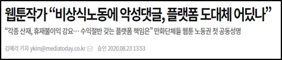
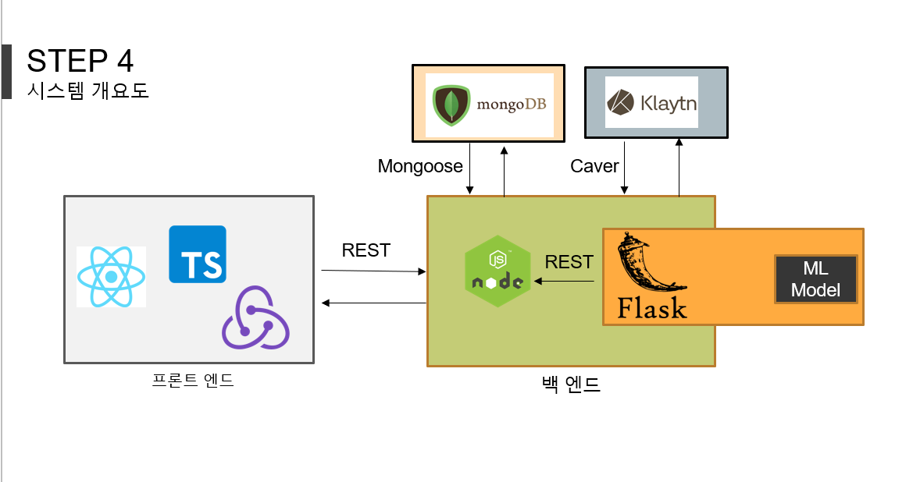

# 시연 동영상 링크
- 유튜브 링크 : https://youtu.be/tnxIzn5vjOE

# 블록체인과 인공지능을 활용한 웹툰 플랫폼

"2019년 웹툰 작가 실태조사" - 한국콘텐츠진흥원  
  
- 작가들은 작품을 만드는데 평균적으로 일주일 중 6일을 10시간 동안 일한다고 답변하였습니다. 그러나 플랫폼과 웹툰 작가들의 수익 구조는 매우 불균형적입니다. 플랫폼은 어떠한 손해도 보지않는 방식을 취하고 있지만, 작가들은 이러한 행태에 반발하지 못하고 작품을 중단하는 사례가 증가하고 있습니다.
- 또한, 대부분의 웹툰 플랫폼은 작가들의 작품에만 의존할 뿐, 이렇다할 컨텐츠들이 많지 않습니다. 
- 이러한 문제를 해결하기 위하여, 블록체인을 활용해 독자가 직접 작가에게 수익을 전달하는 해결책을 생각하였고, 인공지능을 통한 플랫폼의 컨텐츠 개발을 제시하였습니다.
- 블록체인은 Klaytn을 사용하였고, ERC-20 토큰을 활용하여 웹툰에서 사용하는 토큰처럼 만들었습니다.
- 인공지능은 다음과 같습니다.
    1. 웹툰 캐릭터로 사용자를 바꾸어주는 Selfie2Webtoon (U-GAT-IT 사용)
    2. 작가들의 작품에 보이지 않은 일련 번호를 저장하는 Steganography (SteganoGAN 사용)
    3. 작가들이 악플에 신경쓰지않고, 작품이나 그림체에 관한 덧글만 볼 수 있도록하는 NLP

# 시스템 개요도
다음 시스템 개요도는 실제 발표에서 사용했던 개요도 입니다.


- 프론트 엔드 : React와 Typescript를 사용하여 개발하였고, 상태 관리로는 Redux를 사용하였습니다.
- Nodejs : Nodejs는 DB와의 연결, 블록체인과의 연결, 로그인 기능 등 일반적인 서버 기능을 하기위해 사용했습니다.
- Flask : Flask는 pytorch로 만들어진 인공지능 모델과의 연동을 위해 사용하였습니다.
- 블록체인 : 이더리움보다 트랜잭션 처리 속도가 빠르고 docs가 잘 정리되어 Klaytn을 사용하였습니다. 
- DB : 클라우드로 사용하였고, nodejs와 궁합이 좋아 MongoDB를 사용하였습니다. 

# 공지사항 (12/04)
- 학교 GPU 컴퓨터를 이제 사용하지 못하여 개발을 진행하지 못할 것 같습니다. 돈도 벌고(?) 능력도 좋아지면 컴퓨터 하나 장만하여, 더 좋은 모델로 서비스를 제공하겠습니다.
- flask 서버가 있는 폴더에 모델 관련 파일들이 있는데, 이 부분의 정리가 필요합니다. (개발자분들 정리 부탁드립니다.)
- 또, 프리드로우 데이터로 학습을 진행한 U-GAT-IT 모델은 너무 무거워 github에 올리지 않았습니다. 필요하신 분들은 메일(gyoue200125@gmail.com) 부탁드립니다.
- 따라서 현재 프로젝트만 다운받으시면 selfie2webtoon 기능을 사용할 수 없어 flask의 run_model 메서드의 반환값을 "success"로만 두었습니다.
- 만약, 모델을 받으셨다면, run_model에 적재하신 다음 return으로 변환된 이미지를 주시면, frontend의 dropbox부분에서 값을 가져와 렌더링을 시켜주도록 하면 됩니다.

# 실행 방법
- 그러나 실행이 안되는 것은 아닙니다. selfie2webtoon부분을 제거하고 다른 기능들은 사용이 가능합니다.
- 프론트 엔드 실행
프론트 엔드 파일에 대한 설명을 보시고 싶으면 frontend폴더의 README.md를 읽어주세요.
```
cd .\frontend\
npm install
npm run start
```

- 백엔드 nodejs 서버 실행(nodemon 실행) , 단 mongoDB 클라우드 key를 config/dev.js를 만들고 입력해주세요.
자세한 사항은 backend/nodejs 폴더의 README.md에 적어두었습니다.
```
cd .\backend\nodejs_server\
npm install
npm run dev
```

- 백엔드 flask 서버 실행(디버그 모드 입니다.)
```
cd .\backend\flask_server\
python app.py
```
인공지능 담당 개발자 분들은 해당 flask_server의 파일 정리 및 라이브러리 정리 부탁드립니다.

# 개발자
- 프론트 엔드 / 백엔드 / 블록체인 : 박규영 ( gyu-young-park , 필자 )
- 백엔드 / 블록체인 / NLP : 윤동희 ( dhsimpson )
- GAN(U-GAT-IT을 이용한 selfie2webtoon) : 김민수 ( neonkill )
- GAN(SteganoGAN을 이용한 스테가노그래피) : 신준범 ( Jartfo )